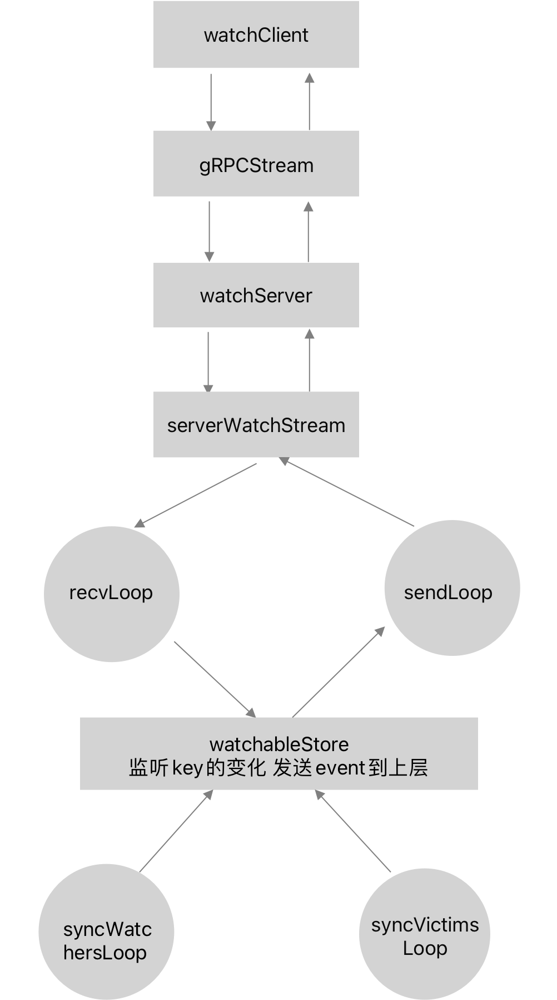

title: Etcd watch机制详解
tags:
- Etcd
- 源码
description: watch是etcd的重要特性之一，有着非常广泛的应用，本文将详细介绍etcd watch设计原理与源码实现。
---

# 概述

watch机制是etcd设计的一大特色，客户端通过监听指定的key可以迅速感知key的变化并作出相应处理，watch机制的实现依赖于资源版本号revision的设计，每一次key的更新都会使得revision原子递增，因此根据不同的版本号revision的对比就可以感知新事件的发生。etcd watch机制有着广泛的应用，比如利用etcd实现分布式锁；k8s中监听各种资源的变化，从而实现各种controller逻辑等。

# 整体流程



watch机制的实现主要可分为三个部分，分别是客户端gRPC调用、server端gRPC处理以及从底层存储获取跟新事件。client使用`watchClient`的watch接口发起watch请求，与server端建立一个`gRPCStream`连接，server端会为每个client生成唯一一个watch id，并记录每个client也就是watcher监听的key或者key range，通过recvLoop接收client请求，通过sendLoop发送请求，server端只负责收发请求和响应，主要的实现都放在了watchalbStore层。watchalbStore会监听key的变化，然后通过syncWatchersLoop和syncVictimsLoop两个处理流程将key的更新变化包装成event，通过channel发送给gRPC server，具体来说，watchableStore会在每次处理事务时都会回调一个通知函数，该函数将每次的key更新事件与客户端监听的key进行值和revision的比对，一旦相应的key有变化，就会把这些更新推送给server端，然后server通过gRPC将更新事件再发送到客户端，从而实现客户端总是能实时感知到key的变化，整个流程做到闭环。

# client请求

根据`etcdserver/etcdserverpb/rpc.pb.go`的定义，client端调用`NewWatchClient`生成一个watchClient，然后调用Watch方法生成一个`Watch_WatchClient`的client。

```go
type WatchClient interface {
   // Watch watches for events happening or that have happened. Both input and output
   // are streams; the input stream is for creating and canceling watchers and the output
   // stream sends events. One watch RPC can watch on multiple key ranges, streaming events
   // for several watches at once. The entire event history can be watched starting from the
   // last compaction revision.
   Watch(ctx context.Context, opts ...grpc.CallOption) (Watch_WatchClient, error)
}

type watchClient struct {
   cc *grpc.ClientConn
}

func NewWatchClient(cc *grpc.ClientConn) WatchClient {
   return &watchClient{cc}
}
func (c *watchClient) Watch(ctx context.Context, opts ...grpc.CallOption) (Watch_WatchClient, error) {
	stream, err := grpc.NewClientStream(ctx, &_Watch_serviceDesc.Streams[0], c.cc, "/etcdserverpb.Watch/Watch", opts...)
	if err != nil {
		return nil, err
	}
	x := &watchWatchClient{stream}
	return x, nil
}
```

`Watch_WatchClient`接口定义了两个方法，分别是发送/接收watch请求的Send和Recv。

```go
type Watch_WatchClient interface {
   Send(*WatchRequest) error
   Recv() (*WatchResponse, error)
   grpc.ClientStream
}
```

客户端只需调用Watch接口即可建立一个watch请求，底层的gRPCStream连接已由gRPC自动建立，client端只需关注watch请求和返回值即可。

# server端处理

server端进行处理的结构体为watchServer，代码位置`etcdserver/api/v3rpc/watch.go`

```go
type watchServer struct {
   lg *zap.Logger

   clusterID int64
   memberID  int64

   maxRequestBytes int

   sg        etcdserver.RaftStatusGetter
   // 实现: watchable_store.go watchableStore
   watchable mvcc.WatchableKV
   ag        AuthGetter
}
```

`watchable`是关键字段，具体实现即为store层`watchableStore`，是整个watch时间的最底层来源，后面会具体介绍，这里仅先关注gRPC server端的处理流程。

`NewWatchServer`在初始化时会建立`watchableStore`，然后就是具体的Watch方法实现

```go
func (ws *watchServer) Watch(stream pb.Watch_WatchServer) (err error) {
   sws := serverWatchStream{
      maxRequestBytes: ws.maxRequestBytes,
      watchable: ws.watchable,
     // gRPC连接
      gRPCStream:  stream,
      watchStream: ws.watchable.NewWatchStream(),
      // chan for sending control response like watcher created and canceled.
      ctrlStream: make(chan *pb.WatchResponse, ctrlStreamBufLen),
      progress: make(map[mvcc.WatchID]bool),
      prevKV:   make(map[mvcc.WatchID]bool),
      fragment: make(map[mvcc.WatchID]bool),
      closec: make(chan struct{}),
   }

   sws.wg.Add(1)
   go func() {
     // 发送watch相应到client
      sws.sendLoop()
      sws.wg.Done()
   }()

   errc := make(chan error, 1)
   go func() {
     // 从client端接收watch请求
      if rerr := sws.recvLoop(); rerr != nil {
         errc <- rerr
      }
   }()

   select {
   case err = <-errc:
      close(sws.ctrlStream)

   case <-stream.Context().Done():
      err = stream.Context().Err()
      // the only server-side cancellation is noleader for now.
      if err == context.Canceled {
         err = rpctypes.ErrGRPCNoLeader
      }
   }

   sws.close()
   return err
}
```

简化下代码可以看到server端会首先新建一个serverWatchStream，然后通过两个主要的goroutine recvLoop和sendLoop进行处理，分别进行watch请求的接收和响应。

## recvLoop

`recvLoop`会处理三种watch请求

- CreateRequest 创建新请求
- CancelRequest 取消请求
- ProgressRequest 查看watch进度

### 创建新的watch请求

```go
func (sws *serverWatchStream) recvLoop() error {
   for {
      req, err := sws.gRPCStream.Recv()
      if err == io.EOF {
         return nil
      }
      if err != nil {
         return err
      }

      switch uv := req.RequestUnion.(type) {
      // 创建watch请求
      case *pb.WatchRequest_CreateRequest:
         if uv.CreateRequest == nil {
            break
         }

         // 确定watch key的begin-end范围
         creq := uv.CreateRequest
         if len(creq.Key) == 0 {
            // \x00 is the smallest key
            creq.Key = []byte{0}
         }
         if len(creq.RangeEnd) == 0 {
            // force nil since watchstream.Watch distinguishes
            // between nil and []byte{} for single key / >=
            creq.RangeEnd = nil
         }
         if len(creq.RangeEnd) == 1 && creq.RangeEnd[0] == 0 {
            // support  >= key queries
            creq.RangeEnd = []byte{}
         }

         // 从context里获取username校验用户是否在请求的range key范围内有权限
         if !sws.isWatchPermitted(creq) {
            wr := &pb.WatchResponse{
               Header:       sws.newResponseHeader(sws.watchStream.Rev()),
               WatchId:      creq.WatchId,
               Canceled:     true,
               Created:      true,
               CancelReason: rpctypes.ErrGRPCPermissionDenied.Error(),
            }

            select {
            case sws.ctrlStream <- wr:
               continue
            case <-sws.closec:
               return nil
            }
         }

         // 过滤客户端指定的事件，PUT/DELETE
         filters := FiltersFromRequest(creq)

         wsrev := sws.watchStream.Rev()
         rev := creq.StartRevision
         if rev == 0 {
            rev = wsrev + 1
         }
         id, err := sws.watchStream.Watch(mvcc.WatchID(creq.WatchId), creq.Key, creq.RangeEnd, rev, filters...)
         if err == nil {
            sws.mu.Lock()
            if creq.ProgressNotify {
               sws.progress[id] = true
            }
            if creq.PrevKv {
               sws.prevKV[id] = true
            }
            if creq.Fragment {
               sws.fragment[id] = true
            }
            sws.mu.Unlock()
         }
         wr := &pb.WatchResponse{
            Header:   sws.newResponseHeader(wsrev),
            WatchId:  int64(id),
            Created:  true,
            Canceled: err != nil,
         }
         if err != nil {
            wr.CancelReason = err.Error()
         }
         select {
         case sws.ctrlStream <- wr:
         case <-sws.closec:
            return nil
         }
      }
   }
}
```

server端会根据creq请求参数的Key和RangeEnd确定请求的key的范围，然后从请求中取出authInfo认证信息校验请求用户对请求的key是否有权限，校验通过后生成包含revision和和watchID的watchResponse到client端，这里的发送是异步的，只是将watchResponse发送到serverWatchStream的ctrlStream channel里，由sendLoop协程发送到client。然后会过滤掉客户端指定的事件，比如删除、更新事件。

最后会调用watchStream的watch方法进行key的二次校验，生成watcherID并记录每一个watcher。并为每一个watcher生成一个cancel函数并存储在cancels map中，代码位置`mvcc/watcher.go`。

```go
type watchStream struct {
   // 实现: mvcc/watchable_store.go watchableStore
   watchable watchable
   ch        chan WatchResponse

   mu sync.Mutex // guards fields below it
   // nextID is the ID pre-allocated for next new watcher in this stream
   // 当客户端未指定watch id时，会用next id自动分配一个id
   nextID   WatchID
   closed   bool
   cancels  map[WatchID]cancelFunc
   watchers map[WatchID]*watcher
}
```

```go
// Watch creates a new watcher in the stream and returns its WatchID.
func (ws *watchStream) Watch(id WatchID, key, end []byte, startRev int64, fcs ...FilterFunc) (WatchID, error) {
   // prevent wrong range where key >= end lexicographically
   // watch request with 'WithFromKey' has empty-byte range end
   // key的字母序不能大于等于end
   if len(end) != 0 && bytes.Compare(key, end) != -1 {
      return -1, ErrEmptyWatcherRange
   }

   ws.mu.Lock()
   defer ws.mu.Unlock()
   if ws.closed {
      return -1, ErrEmptyWatcherRange
   }

   if id == AutoWatchID {
      for ws.watchers[ws.nextID] != nil {
         ws.nextID++
      }
      id = ws.nextID
      ws.nextID++
      // 校验watch id不能重复
   } else if _, ok := ws.watchers[id]; ok {
      return -1, ErrWatcherDuplicateID
   }

   w, c := ws.watchable.watch(key, end, startRev, id, ws.ch, fcs...)

   ws.cancels[id] = c
   ws.watchers[id] = w
   return id, nil
}
```

### 取消watch请求

取消watch请求会调用watchStream的Cancel函数删除watcher记录，并调用创建watch请求时每个watcher对应的cancel函数进行事件清理工作。然后同样将watchResponse发送给client端。

```go
func (sws *serverWatchStream) recvLoop() error {
   for {
      req, err := sws.gRPCStream.Recv()
      if err == io.EOF {
         return nil
      }
      if err != nil {
         return err
      }

      switch uv := req.RequestUnion.(type) {
         // 取消watch请求
      case *pb.WatchRequest_CancelRequest:
         if uv.CancelRequest != nil {
            id := uv.CancelRequest.WatchId
            err := sws.watchStream.Cancel(mvcc.WatchID(id))
            if err == nil {
              // 发送
               sws.ctrlStream <- &pb.WatchResponse{
                  Header:   sws.newResponseHeader(sws.watchStream.Rev()),
                  WatchId:  id,
                  Canceled: true,
               }
               sws.mu.Lock()
               delete(sws.progress, mvcc.WatchID(id))
               delete(sws.prevKV, mvcc.WatchID(id))
               delete(sws.fragment, mvcc.WatchID(id))
               sws.mu.Unlock()
            }
         }
      }
   }
}
```

```go
func (ws *watchStream) Cancel(id WatchID) error {
   ws.mu.Lock()
   cancel, ok := ws.cancels[id]
   w := ws.watchers[id]
   ok = ok && !ws.closed
   ws.mu.Unlock()

   if !ok {
      return ErrWatcherNotExist
   }
  // 调用创建watch请求时指定的cancel回调函数进行event清理工作
   cancel()

   ws.mu.Lock()
   // The watch isn't removed until cancel so that if Close() is called,
   // it will wait for the cancel. Otherwise, Close() could close the
   // watch channel while the store is still posting events.
   if ww := ws.watchers[id]; ww == w {
      delete(ws.cancels, id)
      delete(ws.watchers, id)
   }
   ws.mu.Unlock()

   return nil
}
```

### 查询watch请求进度

查询watch请求会返回当前的revision给client端。

```go
func (sws *serverWatchStream) recvLoop() error {
   for {
      req, err := sws.gRPCStream.Recv()
      if err == io.EOF {
         return nil
      }
      if err != nil {
         return err
      }

      switch uv := req.RequestUnion.(type) {
         // 查询watch请求进度，返回当前的revision
      case *pb.WatchRequest_ProgressRequest:
         if uv.ProgressRequest != nil {
            sws.ctrlStream <- &pb.WatchResponse{
               Header:  sws.newResponseHeader(sws.watchStream.Rev()),
               WatchId: -1, // response is not associated with any WatchId and will be broadcast to all watch channels
            }
         }
      default:
         // we probably should not shutdown the entire stream when
         // receive an valid command.
         // so just do nothing instead.
         continue
      }
   }
}
```

## sendLoop

`recvLoop`处理完三种请求后只是将watchResponse信息放在了channel中，真正的发送是在`sendLoop`中实现的，而且以上三种请求的watchResponse信息里压根没有event信息，因此sendLoop主要从两个channel里读取信息发送给client端，一个可以理解为watchResponse Header，即ctrlStream channel，一个就是真正的event信息`ws.watchStream.Chan()` channel。

event事件信息来自于`ws.watchStream.Chan()`的channel，这个channel数据来源就是store层也就是watchableStore层传递上来的，我们将最后梳理这部分的逻辑，这里仍然只关注gRPC server的处理

```go
func (sws *serverWatchStream) sendLoop() {
   // watch ids that are currently active
   ids := make(map[mvcc.WatchID]struct{})
   // watch responses pending on a watch id creation message
   pending := make(map[mvcc.WatchID][]*pb.WatchResponse)

   interval := GetProgressReportInterval()
   progressTicker := time.NewTicker(interval)

   // 记录metrics数据，并做一些清理工作
   defer func() {
      progressTicker.Stop()
      // drain the chan to clean up pending events
      for ws := range sws.watchStream.Chan() {
         mvcc.ReportEventReceived(len(ws.Events))
      }
      for _, wrs := range pending {
         for _, ws := range wrs {
            mvcc.ReportEventReceived(len(ws.Events))
         }
      }
   }()

   // sendLoop监听两个channel
   // 1、创建/取消watch时的返回信息 ctrlStream
   // 2、新产生的事件 sws.watchStream.Chan()
   for {
      select {
      case wresp, ok := <-sws.watchStream.Chan():
         if !ok {
            return
         }

         // TODO: evs is []mvccpb.Event type
         // either return []*mvccpb.Event from the mvcc package
         // or define protocol buffer with []mvccpb.Event.
         evs := wresp.Events
         events := make([]*mvccpb.Event, len(evs))
         sws.mu.RLock()
         needPrevKV := sws.prevKV[wresp.WatchID]
         sws.mu.RUnlock()
         for i := range evs {
            events[i] = &evs[i]
            if needPrevKV {
               opt := mvcc.RangeOptions{Rev: evs[i].Kv.ModRevision - 1}
               r, err := sws.watchable.Range(evs[i].Kv.Key, nil, opt)
               if err == nil && len(r.KVs) != 0 {
                  events[i].PrevKv = &(r.KVs[0])
               }
            }
         }

         canceled := wresp.CompactRevision != 0
         //  带有event的watchResponse
         wr := &pb.WatchResponse{
            Header:          sws.newResponseHeader(wresp.Revision),
            WatchId:         int64(wresp.WatchID),
            Events:          events,
            CompactRevision: wresp.CompactRevision,
            Canceled:        canceled,
         }

         if _, okID := ids[wresp.WatchID]; !okID {
            // buffer if id not yet announced
            wrs := append(pending[wresp.WatchID], wr)
            pending[wresp.WatchID] = wrs
            continue
         }

         mvcc.ReportEventReceived(len(evs))

         sws.mu.RLock()
         fragmented, ok := sws.fragment[wresp.WatchID]
         sws.mu.RUnlock()

         var serr error
         // 判断是否需要分段发送
         if !fragmented && !ok {
            serr = sws.gRPCStream.Send(wr)
         } else {
            serr = sendFragments(wr, sws.maxRequestBytes, sws.gRPCStream.Send)
         }
        ...
         sws.mu.Lock()
         if len(evs) > 0 && sws.progress[wresp.WatchID] {
            // elide next progress update if sent a key update
            sws.progress[wresp.WatchID] = false
         }
         sws.mu.Unlock()
      }
   }
}
```

同样对于ctrlStream的处理大同小异，不在赘述。

# watchableStore处理

以上的处理流程分析仅限于gRPC层的client和server端数据交互，并未涉及真正的event数据的产生，那么event数据到底是怎么产生并且发送给上层gRPC端的呢？这就是本节`watchableStore`要做的事。

在创建新的watch请求一节的分析中我们知道，server端的watch请求调用了watchStream的wach方法，继续分析

`watchStream`的wach方法可以发现它继续调用了watchable的watch方法。

```go
w, c := ws.watchable.watch(key, end, startRev, id, ws.ch, fcs...)
```

并且传入了一个ws.ch字段，而这个channel正是sendLoop中的接收事件的channel，因此可以发现watchableStore正是通过watchStream的这个channel将事件传送给gRPC server端。代码位置mvcc/watcher.go

```go
func (ws *watchStream) Chan() <-chan WatchResponse {
   return ws.ch
}
```

那么watchableStore究竟是怎么处理的呢？进一步分析`watchableStore`的watch方法可以知道在处理每个watch请求时，会将每个watch请求放入到一个watchGroup的结构体中，watchGroup记录了watcher关注的key与watcher映射的集合，其中又分为关注单个key的watcher以及关注区间key的watcher，关注单个key的watcher直接放在map里存储，而关注区间的watcher则使用了区间树进行记录，以提高查找watcher的效率。

```go
// watcherGroup is a collection of watchers organized by their ranges
type watcherGroup struct {
   // 单个key对应的watcher
   // keyWatchers has the watchers that watch on a single key
   keyWatchers watcherSetByKey
   // ranges has the watchers that watch a range; it is sorted by interval
   // 区间对应的watcher
   ranges adt.IntervalTree
   // watchers is the set of all watchers
   watchers watcherSet
}
```

并且watch会根据watch请求的start revision进行分类，如果start revison比当前revision大或者从当前时刻开始监听，则把该请求放入sync集合，否则放入unsynced集合，为什么要这么分类呢？很显然如果从当前或者未来的某个revision版本号开始watch，则代表只有未来发生的事件才会被发送到相应watcher，也就是目前所有的事件都已同步，因此放到sync集合代表已同步，反之代表查询的是历史事件，由于历史事件需要查询bbolt数据，查询需要耗时因此放到unsynced集合代码数据还未同步，代码位置`mvcc/watchable_store.go`

```go
func (s *watchableStore) watch(key, end []byte, startRev int64, id WatchID, ch chan<- WatchResponse, fcs ...FilterFunc) (*watcher, cancelFunc) {
   wa := &watcher{
      key:    key,
      end:    end,
      minRev: startRev,
      id:     id,
      ch:     ch,
      fcs:    fcs,
   }

   s.mu.Lock()
   s.revMu.RLock()
   synced := startRev > s.store.currentRev || startRev == 0
   // 查询的不是是历史版本，直接放到synced watchGroup
   if synced {
      wa.minRev = s.store.currentRev + 1
      if startRev > wa.minRev {
         wa.minRev = startRev
      }
   }
   if synced {
      s.synced.add(wa)
   } else {
      // 查询的是历史版本，需要到bbolt查找，放到unsynced watchGroup
      slowWatcherGauge.Inc()
      s.unsynced.add(wa)
   }
   s.revMu.RUnlock()
   s.mu.Unlock()

   watcherGauge.Inc()

   return wa, func() { s.cancelWatcher(wa) }
}
```

`watcherableStore`的watch方法仅仅将watcher添加到了sync或者unsynced结合，那么真正处理这些watcher的逻辑在哪里呢？

`watcheableStore`在初始化的时候会有两个goroutine启动，分别是`syncWatchersLoop`和`syncVictimsLoop`，这是两个同步是事件到watcher的关键函数。而watchableStore的初始化时上层etcd server做的，在etcd server启动时就持久运行。syncWatchersLoop会持续处理unsynced集合里watcher，如果都已同步则等待100ms后进行下一次同步，而syncVictimsLoop则处理阻塞的暂时没发送到gRPC server端的事件。代码位置`mvcc/watchable_store.go`

```go
func newWatchableStore(lg *zap.Logger, b backend.Backend, le lease.Lessor, as auth.AuthStore, ig ConsistentIndexGetter, cfg StoreConfig) *watchableStore {
   s := &watchableStore{
      store:    NewStore(lg, b, le, ig, cfg),
      victimc:  make(chan struct{}, 1),
      unsynced: newWatcherGroup(),
      synced:   newWatcherGroup(),
      stopc:    make(chan struct{}),
   }
   s.store.ReadView = &readView{s}
   s.store.WriteView = &writeView{s}
   if s.le != nil {
      // use this store as the deleter so revokes trigger watch events
      s.le.SetRangeDeleter(func() lease.TxnDelete { return s.Write(traceutil.TODO()) })
   }
   if as != nil {
      // TODO: encapsulating consistentindex into a separate package
      as.SetConsistentIndexSyncer(s.store.saveIndex)
   }
   s.wg.Add(2)
   // 每100ms处理unsynced的请求
   go s.syncWatchersLoop()
   // 处理victim也就是阻塞的事件
   go s.syncVictimsLoop()
   return s
}
```

## syncWatchersLoop

syncWatchersLoop调用syncWatchers方法进行同步，分四个步骤进行

1. 从unsynced集合中选取一部分watchers集合
2. 遍历集合选出最小的revision并且移除掉revision已经被压缩的watcher
3. 使用最小的revision获得所有所有kv pair发送给相应的wacher
4. 当unsynced集合里的watcher事件都发送完毕后将watcher移出unsynced，放入sync集合

代码位置`mvcc/watchable_store.go`

```go
func (s *watchableStore) syncWatchers() int {
   s.mu.Lock()
   defer s.mu.Unlock()

   if s.unsynced.size() == 0 {
      return 0
   }

   s.store.revMu.RLock()
   defer s.store.revMu.RUnlock()

   // in order to find key-value pairs from unsynced watchers, we need to
   // find min revision index, and these revisions can be used to
   // query the backend store of key-value pairs
   curRev := s.store.currentRev
   compactionRev := s.store.compactMainRev

   // step1、step2
   wg, minRev := s.unsynced.choose(maxWatchersPerSync, curRev, compactionRev)
   minBytes, maxBytes := newRevBytes(), newRevBytes()
   revToBytes(revision{main: minRev}, minBytes)
   revToBytes(revision{main: curRev + 1}, maxBytes)

   // UnsafeRange returns keys and values. And in boltdb, keys are revisions.
   // values are actual key-value pairs in backend.
   tx := s.store.b.ReadTx()
   tx.RLock()
  
   // step3
   revs, vs := tx.UnsafeRange(keyBucketName, minBytes, maxBytes, 0)
   var evs []mvccpb.Event
   if s.store != nil && s.store.lg != nil {
      // 对key进行转换并过滤掉没有被watch的key
      evs = kvsToEvents(s.store.lg, wg, revs, vs)
   } else {
      // TODO: remove this in v3.5
      evs = kvsToEvents(nil, wg, revs, vs)
   }
   tx.RUnlock()

   var victims watcherBatch
   // 产生watcher和其对应的eventBatch
   wb := newWatcherBatch(wg, evs)
   for w := range wg.watchers {
      // 重新设置nimRev防止重复接收事件
      w.minRev = curRev + 1

      eb, ok := wb[w]
      if !ok {
         // bring un-notified watcher to synced
         s.synced.add(w)
         s.unsynced.delete(w)
         continue
      }

      if eb.moreRev != 0 {
         w.minRev = eb.moreRev
      }
     
      // step3
      if w.send(WatchResponse{WatchID: w.id, Events: eb.evs, Revision: curRev}) {
         pendingEventsGauge.Add(float64(len(eb.evs)))
      } else {
         // 如果发送到chan时阻塞，说明有block，此时把watcher和对应的event batch加入到victims
         if victims == nil {
            victims = make(watcherBatch)
         }
         w.victim = true
      }

      if w.victim {
         victims[w] = eb
      } else {
         if eb.moreRev != 0 {
            // stay unsynced; more to read
            continue
         }
         // step4
         // 添加到已同步集合
         s.synced.add(w)
      }
      // 从未同步集合移除
      s.unsynced.delete(w)
   }
   s.addVictim(victims)

   vsz := 0
   for _, v := range s.victims {
      vsz += len(v)
   }
   slowWatcherGauge.Set(float64(s.unsynced.size() + vsz))

   return s.unsynced.size()
}
```

重点关注一下其中的`newWatcherBatch`函数，该函数传入watcherGroup和所有从bbolt查询的事件，然后根每个key的ModRevision与每个watcher关注的minRev进行比较，ModRevision大于minRev意味着key有了更新事件，因此会该事件会添加到对应watcher的eventBatch集合里。

```go
// 返回watcher和对应的event
func newWatcherBatch(wg *watcherGroup, evs []mvccpb.Event) watcherBatch {
   if len(wg.watchers) == 0 {
      return nil
   }

   wb := make(watcherBatch)
   // 遍历所有的Event，根据Event的key来查找指定的watcher
   for _, ev := range evs {
      for w := range wg.watcherSetByKey(string(ev.Kv.Key)) {
         // 说明指定的key发生了变化
         if ev.Kv.ModRevision >= w.minRev {
            // don't double notify
            wb.add(w, ev)
         }
      }
   }
   return wb
}
```

## syncVictimsLoop

由于send事件用的channel没有缓存，因此如果在发生阻塞时会创建victim集合记录阻塞的watcher和对应的eventBatch，然后由`syncVictimsLoop`协程进行单独处理。

```go
func (s *watchableStore) syncVictimsLoop() {
   defer s.wg.Done()

   for {
      // 不等于0说明一直有pending的event可以发送，所以一直发送
      // 直到所有的event全部阻塞
      for s.moveVictims() != 0 {
         // try to update all victim watchers
      }
      s.mu.RLock()
      isEmpty := len(s.victims) == 0
      s.mu.RUnlock()

      var tickc <-chan time.Time
      if !isEmpty {
         // victims不为空10ms处理一次
         tickc = time.After(10 * time.Millisecond)
      }

      select {
      case <-tickc:
         // 阻塞到这里等待有victims产生
      case <-s.victimc:
      case <-s.stopc:
         return
      }
   }
}
```

该函数会持续调用`moveVictims`尝发送victims阻塞的watcher，直到阻塞的watcher事件全部发送完毕。

```go
// moveVictims tries to update watches with already pending event data
func (s *watchableStore) moveVictims() (moved int) {
   s.mu.Lock()
   victims := s.victims
   s.victims = nil
   s.mu.Unlock()

   var newVictim watcherBatch
   for _, wb := range victims {
      // try to send responses again
      // 尝试继续发送阻塞的事件
      for w, eb := range wb {
         // watcher has observed the store up to, but not including, w.minRev
         rev := w.minRev - 1
         if w.send(WatchResponse{WatchID: w.id, Events: eb.evs, Revision: rev}) {
            pendingEventsGauge.Add(float64(len(eb.evs)))
         } else {
            if newVictim == nil {
               newVictim = make(watcherBatch)
            }
            newVictim[w] = eb
            continue
         }
         moved++
      }

      // assign completed victim watchers to unsync/sync
      s.mu.Lock()
      s.store.revMu.RLock()
      curRev := s.store.currentRev
      for w, eb := range wb {
         if newVictim != nil && newVictim[w] != nil {
            // couldn't send watch response; stays victim
            continue
         }
         w.victim = false
         if eb.moreRev != 0 {
            w.minRev = eb.moreRev
         }
         // 存在未同步的事件，放入unsynced，然后由syncWatcherLoop处理
         if w.minRev <= curRev {
            s.unsynced.add(w)
         } else {
            slowWatcherGauge.Dec()
            s.synced.add(w)
         }
      }
      s.store.revMu.RUnlock()
      s.mu.Unlock()
   }

   if len(newVictim) > 0 {
      s.mu.Lock()
      s.victims = append(s.victims, newVictim)
      s.mu.Unlock()
   }

   return moved
}
```

## 新事件来源

以上同步的watcher都是从unsynced集合中取的，也就是说事件来源都是历史事件，那么新来的事件的也就是sync集合里关注的新事件什么时候会被发送呢？这就是前面提到的`watcherableStore`的回调函数，该函数会在每次进行key更新或删除时进行调用，通知有新的事件发生，然后发送到gRPC server上层。

```go
// notify notifies the fact that given event at the given rev just happened to
// watchers that watch on the key of the event.
func (s *watchableStore) notify(rev int64, evs []mvccpb.Event) {
   var victim watcherBatch
   // 选出watcher关注得到事件
   for w, eb := range newWatcherBatch(&s.synced, evs) {
      if eb.revs != 1 {
         if s.store != nil && s.store.lg != nil {
            s.store.lg.Panic(
               "unexpected multiple revisions in watch notification",
               zap.Int("number-of-revisions", eb.revs),
            )
         } else {
            plog.Panicf("unexpected multiple revisions in notification")
         }
      }
      // 发送到上层
      if w.send(WatchResponse{WatchID: w.id, Events: eb.evs, Revision: rev}) {
         pendingEventsGauge.Add(float64(len(eb.evs)))
      } else {
         // move slow watcher to victims
         w.minRev = rev + 1
         if victim == nil {
            victim = make(watcherBatch)
         }
         w.victim = true
         victim[w] = eb
         s.synced.delete(w)
         slowWatcherGauge.Inc()
      }
   }
   // 如果有阻塞的watch事件，放到victim
   s.addVictim(victim)
}
```

回调函数`notify`会在每次key的事务结束时进行调用，通知新事件的产生。

```go
func (tw *watchableStoreTxnWrite) End() {
   changes := tw.Changes()
   if len(changes) == 0 {
      tw.TxnWrite.End()
      return
   }

   rev := tw.Rev() + 1
   evs := make([]mvccpb.Event, len(changes))
   for i, change := range changes {
      evs[i].Kv = &changes[i]
      if change.CreateRevision == 0 {
         evs[i].Type = mvccpb.DELETE
         evs[i].Kv.ModRevision = rev
      } else {
         evs[i].Type = mvccpb.PUT
      }
   }

   // end write txn under watchable store lock so the updates are visible
   // when asynchronous event posting checks the current store revision
   tw.s.mu.Lock()
   // 通知watch有新的事件产生
   tw.s.notify(rev, evs)
   tw.TxnWrite.End()
   tw.s.mu.Unlock()
}
```

# 总结

etcd的watch分层设计合理，各个模块各司其职，通过channel进行模块间的通信，简化了设计也提升了并发处理能力，并且区分了历史事件和实时事件进行不同处理，逻辑变得更加清晰，通过对watch机制源码层面的剖析不仅可以加深对watch机制的理解，同时也可以学习优秀的代码设计。

