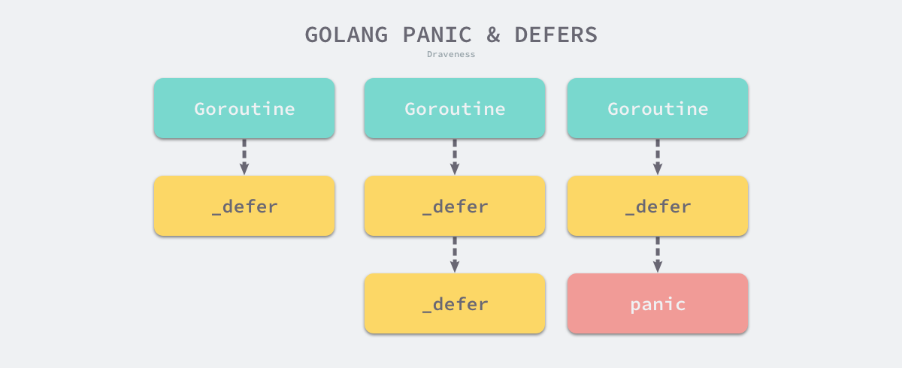

# panic&recover

1. `panic`只会出发当前`goroutine`的`defer`函数，因为`defer`和`panic`都是和某个具体的`goroutine`绑定的

   

   从图中可以看到不同的`goroutine`之间互不影响。同时看出`defer`在panic之前执行

2. `recover`只有在`defer`中调用才会生效

3. 先执行`defer`后执行`panic`里的信息

4. 调用`recover`后恢复程序运行，是怎么做到回到原来的地方继续执行的呢？

   `recover`会判断当前代码内是否有`panic`，没有就执行返回nil，什么也不发生。若有`panixc`，则把`panic`的`recovered `字段设置为true。所以`recover`只做标记，并不负责处理实际的`panic`调用后的返回，真正让`panic`返回的是`reflectcall`调用完`recover`之后，会在pc、sp中记录当前defer的pc、sp，然后调用recovery；`recovery`的函数有`gogo`函数重新调度，但是返回值设置为了1（`gp.sched.ret = 1`）,`deferproc`在后面检查其返回值，如果返回值为0，那么deferproc成功，可以继续处理下一个defer声明或者后面的代码；**如果返回值不为0，那么会跳到当前函数的最后，return之前**。所以可以继续执行之前没完成的defer，并最终返回当前函数的调用者。跳转到 [`runtime.deferreturn`](https://draveness.me/golang/tree/runtime.deferreturn) 函数之后，程序就已经从 `panic` 中恢复了并执行正常的逻辑，而 [`runtime.gorecover`](https://draveness.me/golang/tree/runtime.gorecover) 函数也能从 [`runtime._panic`](https://draveness.me/golang/tree/runtime._panic) 结构中取出了调用 `panic` 时传入的 `arg` 参数并返回给调用方。

